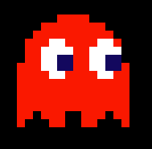
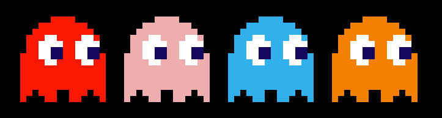
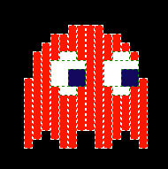

# Pac-Man ghosts

Build a Pac-Man ghost using just HTML and CSS.

The idea is to build a Pac-Man ghost like the picture below using CSS and without
modifying the HTML!

After you create one ghost you can create the rest of them simply by copying the
HTML and giving each one a unique CSS class and then color them accordingly:

1. Blinky `rgb(255,12,19)`
2. Pinky `rgb(242,174,175)`
3. Inky `rgb(27,177,230)`
4. Clyde `rgb(249,126,22)`

Don't worry about trying to make it work on every single browser that exists out
there, the idea is to learn the basics.

## How to start

Please, copy the file [start.html](./start.html) which has the basic HTML
structure of the page and start coding your CSS in the `<style>` tag of the page.

Take the following image as a reference to start desingning the ghost, if you
think of it as it is pixel art, then you can use the `
` elements as the
pixels to build the ghost.

You can take a look at an example solution [here](./example.html).
